# Description
A Civilization IV mapscript which procedurally generates a quasi-realistic map resembling the static map used in the Warlords "Chinese Unification" Mod.


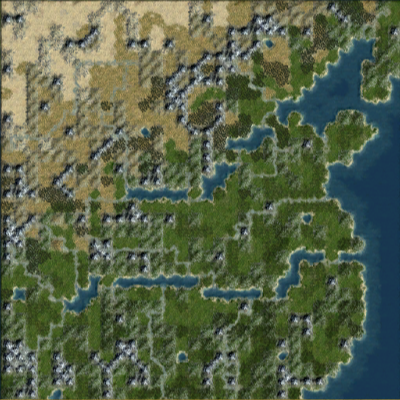

<details>
<summary><h3>Screenshots</h3></summary>
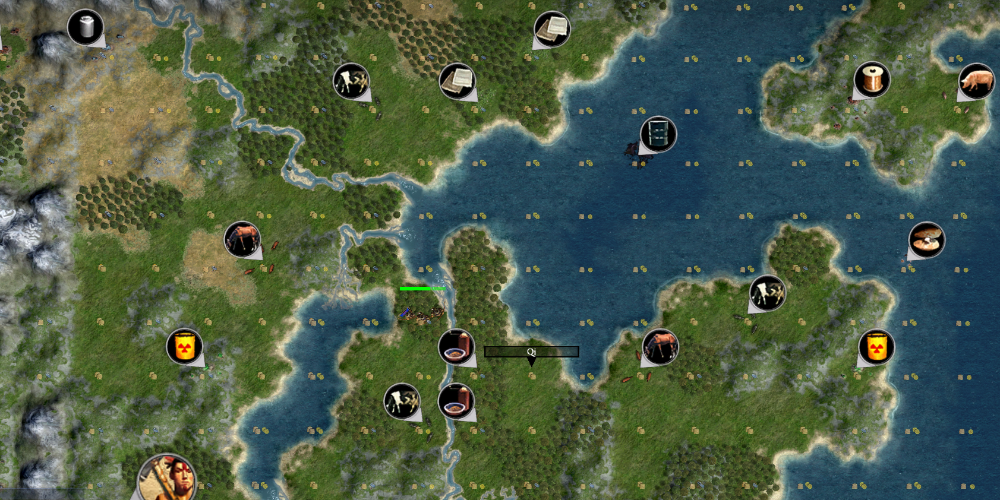
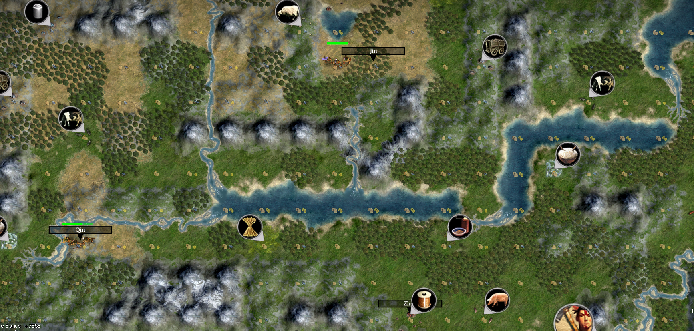
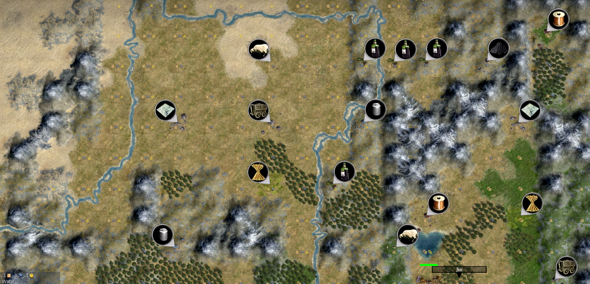
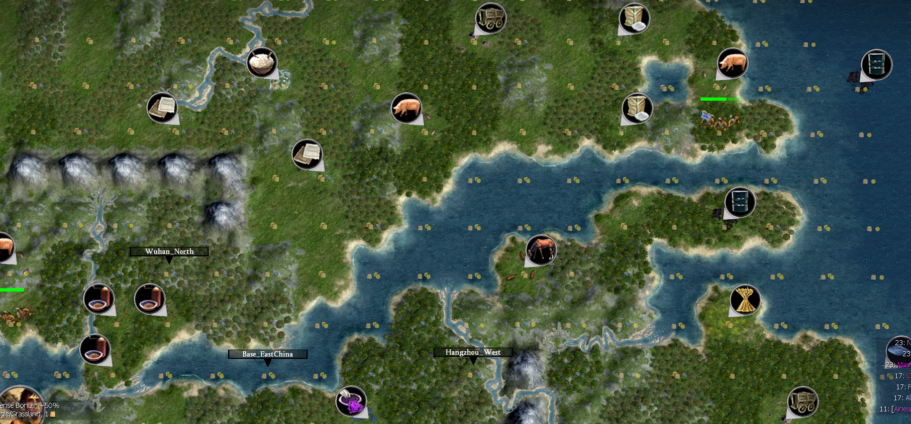
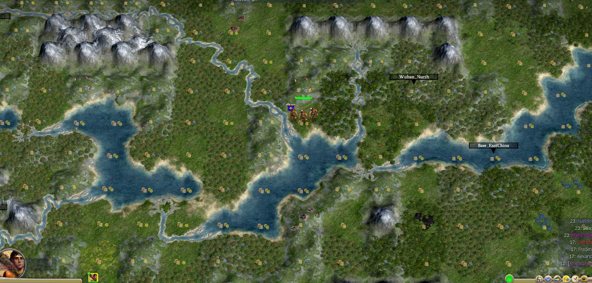
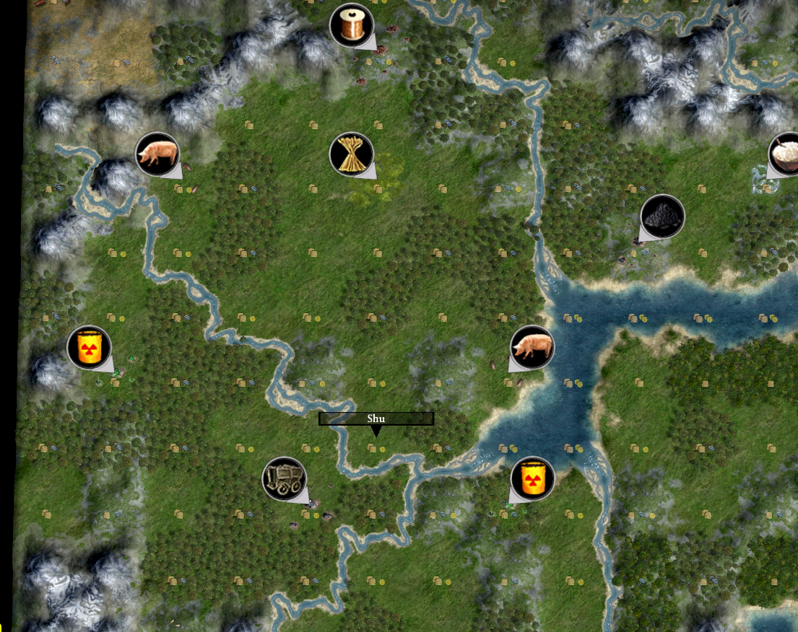
</details>

# Instructions
1. Download Central_Plains.py from the latest [release.](https://github.com/AineiasStymphalios/Central_Plains.py/releases)

2. Add Central_Plains.py to:
- CD version:
```
C:\Program Files\Firaxis Games\Civilization 4\Beyond the Sword\PublicMaps
```

- Steam version:
```
C:\Program Files (x86)\Steam\steamapps\common\Sid Meier's Civilization IV Beyond the Sword\Beyond the Sword\PublicMaps
```
3. Load Civ4. Select Central_Plains through *PLAY NOW* or *CUSTOM GAME.*


## Version support
This mapscript supports Civ4 Beyond the Sword, Warlords, and Vanilla.

## Mod support
This mapscript should work with most vanilla-like mods (e.g. BUG, BUFFY, AdvCiv ...).

# Features
## Map Dimensions
The script generates maps with 1:1 ratio. (This may need adjustment)
| Map Size | Dimensions |
| :--- | :--- |
| Duel | 20×20 |
| Tiny | 24×24 |
| Small | 32×32 |
| Standard | 40×40 |
| Large | 44×44 |
| Huge | 48×48 |


## Climate Options
This mapscript supports climate options.

<details>
<summary><h3>Screenshots</h3></summary>

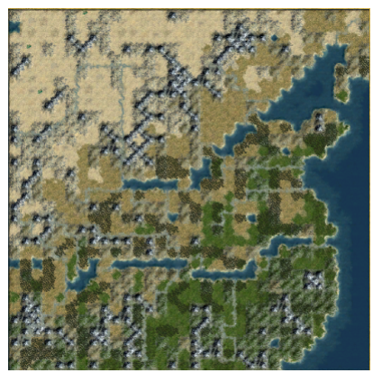
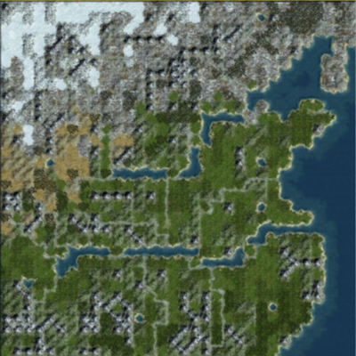
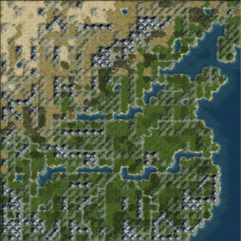
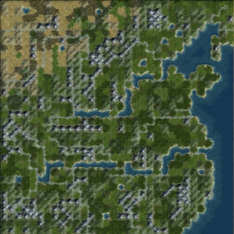
</details>

## Geographic Accuracy Options
- High: Generates all geometric fractal regions and rivers (default).

- Medium: Generates the basic shorelines and the same rivers.
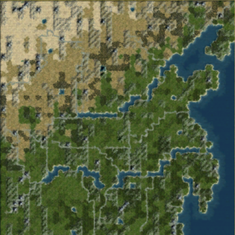
- Low: Generates a crude shoreline, and 3 great rivers running eastwards.
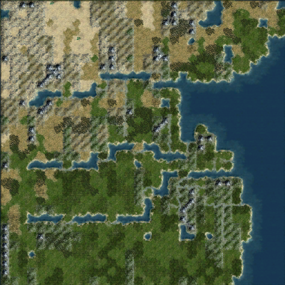

## River Options
The mapscript manually draws important rivers as regular rivers or 1-tile waterways with land bridges.
- Great River Options: Option to draw the Yellow and Long rivers (and the pseudo-Huai in Low-accuracy settings) as bridged waterways, bridgeless waterways, or as regular rivers.
- Other Deep River Options: Does the above for Huai and Han rivers.
- :Lesser River Options: Draw minor rivers manually through preassigned coordinates, or disable it and turn up random river generation density.

## Starting Location Options
- Fixed (Shuffle): Randomly places all players within 6 primary and 4 secondary locations in order of priority. Remaining players are placed with default methods. 
	- If desired, one can force specific civilizations to spawn in specific regions by adding them to civ_mapping under _assign_all_starting_plots().
- Vanilla: Default behavior

Starting regions are roughly based on major states in the Chinese Spring-and-Autumn and Warring States Eras.
 

## Resource Options
The mapscript has three resource related options.
- Starting Plot Min. Food: Ensures at least X amount of land-based food bonuses in starting plot BFC.
- Historical Resources: Removes Corn.
- Ivory Northern Limit: Restricts Ivory placement to historical distributions